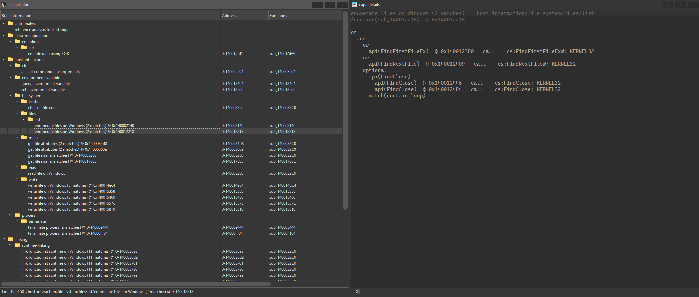
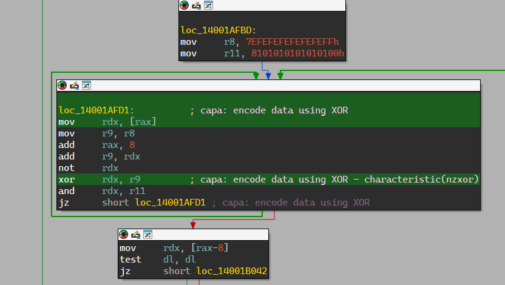

# capa-cpp

> [!Warning]
>This project was entirely generated using Claude. I performed testing for my own use cases, but
> you may run into issues. If you do, feel free to open an issue on this repository!

A targeted C++ reimplementation of [capa](https://github.com/mandiant/capa), Mandiant's tool for
identifying capabilities in executable code. It loads native capa rules and aims to produce the
same matches for the use cases below. It is mainly meant to be driven by other tools, such as
ttd-capa, and to run as an IDA plugin. Running it by hand on TTD traces works but needs the files
those tools produce.

Feature-extractor backends:
- Microsoft's Time Travel Debugging (TTD)
- Windows process memory dumps
- Windows x86/x64 PE files (**IDA Pro only**)

## How it works

Each backend extracts features, such as API calls, strings and numbers, and a common engine
matches rules against them.

| Input | Backend | Scopes |
|---|---|---|
| TTD report JSON (from `ttd-capa`) | Parses recorded API calls | process / thread / span of calls / call |
| TTD `--scan-code` manifest + `.bin` snapshots | Disassembles reconstructed code (unpacked, injected, JIT'd) with [Zydis](https://github.com/zyantific/zydis) | file / function / basic block / instruction |
| Process minidump (`.dmp`) | Parses loaded modules and executable memory, disassembles with Zydis | file / function / basic block / instruction |
| IDA database | uses IDA's CFG, imports, exports, strings and FLIRT names | file / function / basic block / instruction |

## Requirements

- To compile:
  - Windows x64
  - Visual Studio 2022 or 2026 (MSVC v143/v145, C++ 20)
  - vcpkg (the copy bundled with Visual Studio works)
  - For the IDA Pro plugin: the ida-sdk (currently added as a submodule)
- To use:
  - capa [rules](https://github.com/mandiant/capa-rules)

## Building

Builds are located in `build/<Configuration>/`
- **`capa-cpp.exe`**: standalone CLI for TTD traces and Windows process minidumps
- **`ida-capa.dll`**: IDA Pro 9.x plugin that runs capa against the open database

### CLI (`capa-cpp.exe`)

Dependencies are `nlohmann-json`, `yaml-cpp` and `zydis`, linked statically, so the exe has
no runtime dependencies.

```sh
vcpkg install --triplet x64-windows-static --x-manifest-root=capa-cpp
MSBuild capa-cpp/capa-cpp.vcxproj -p:Configuration=Release -p:Platform=x64
```

### IDA plugin (`ida-capa.dll`)

```powershell
vcpkg install --triplet x64-windows-static-md --x-manifest-root=ida-capa
.\ida-capa\build.ps1
```

## Usage
### Command Line (`capa-cpp.exe`)
The command line accepts **TTD reports or Windows process memory dumps**. It does not read a raw
TTD trace: ttd-capa turns the trace into a JSON report and, for code scanning, a code manifest and
memory snapshots.

```sh
# TTD dynamic: report of recorded API calls
capa-cpp <report.ttd.json> -r <rules-dir>               # capability table
capa-cpp <report.ttd.json> -r <rules-dir> -vv           # with match trees
capa-cpp <report.ttd.json> -r <rules-dir> -j -o out.json
capa-cpp <report.ttd.json> -r <rules-dir> --matches-only --msgpack -o out.mp

# TTD static: reconstructed code regions
capa-cpp --scan-code-manifest <manifest.json> -r <rules-dir> [--dumps-dir <dir>] [-o out.json]
```

To scan a Windows process memory dump, use the command below. The file type comes from the file's
magic bytes, so the `.dmp` extension is optional.
```
capa-cpp <process.dmp> -r <rules-dir> [-j | -vv] [--module <name>] [--all-modules]
```

`capa-cpp --rules <rules-dir>` loads a rule directory and reports what was skipped, without
analysing anything. Set `CAPA_CPP_TIMING=1` to print per-phase timings and peak memory use
to stderr.

#### Flags: TTD Reports

The four after `--msgpack` are what keeps a large trace's output manageable.

| Flag | What it does |
|---|---|
| `-r`, `--rules-dir <dir>` | capa rules directory; required for matching |
| `-j`, `--json` | JSON ResultDocument instead of the capability table |
| `-vv`, `--vverbose` | capability table plus the match tree behind every hit |
| `-o`, `--output <path>` | write to a file instead of stdout |
| `--dump-features` | print the extracted features and exit; needs no rules |
| `--check-report-parse` | parse the report and exit |
| `--no-feature-filter` | keep extracted features no loaded rule reads (parity runs) |
| `-f <format>` | accepted and ignored; TTD is the only report format |
| `--msgpack` | encode the JSON document as MessagePack; needs `-j` or `--matches-only` |
| `--matches-only` | rule metadata and match addresses only, with no evidence trees or call layout; implies `-j` |
| `--match-evidence` | one leaf per match, the feature that completed it, instead of a tree |
| `--sparse-evidence` | emit a match whose tree was dropped as a bare address rather than an empty placeholder |
| `--max-match-trees <n>` | evidence trees kept per rule (default 256; `0` keeps all) |
| `--top-level-calls` | match only calls made outside every other recorded call on their thread, using each call's `returnPosition` |

Unknown options are rejected rather than ignored.

#### Flags: TTD Code Manifests

| Flag | What it does |
|---|---|
| `-r`, `--rules-dir <dir>` | required |
| `--dumps-dir <dir>` | where the manifest's `.bin` snapshots are (default: the manifest's own directory) |
| `-o`, `--output <path>` | write the per-region capability records to a file |
| `--quiet` | no per-region progress on stderr |
| `--no-feature-filter` | as above |
| `--scan-dump-features <manifest>` | in place of `--scan-code-manifest`: dump one region's features, `--base <hex>` choosing it |

#### Flags: process memory dumps

This path always writes to stdout; `-o` is not read.

| Flag | What it does |
|---|---|
| `-r`, `--rules-dir <dir>` | required |
| `-j`, `--json` / `-vv`, `--vverbose` | as above |
| `--module <name>` | only regions whose name contains this, case-insensitive |
| `--all-modules` | include Windows system modules, which are skipped by default |
| `--region <hex>` | only the region at this base address |
| `--region-arch <arch>` | decode arch for headerless regions: `x86`/`i386`/`32` or `x64`/`amd64`/`64` |
| `--max-region-size <n>` | skip regions larger than this (default 64M; decimal, `0x` hex, or a K/M/G suffix) |
| `--linear-sweep` | add a linear sweep to code discovery; perturbs a well-formed PE, so it is opt-in |
| `--quiet` | no per-region progress on stderr |
| `--dump-info` / `--dump-modules` / `--dump-symbols [-v]` | describe the dump and exit |
| `--dump-features` | print the extracted features and exit |

### IDA Pro Plugin
Open an x86/x64 binary with the plugin loaded, choose `Edit > Plugins > CAPA C++ > Analyze`, and
give the path to a capa ruleset. When analysis completes, the matches appear as a hierarchy.



The plugin can also annotate matches in the database with highlighting and comments.



## Supported

- capa's rule format, including subscopes. About 1,049 of capa's 1,055 rule files load.
- TTD static and dynamic analysis of x86/x64 traces given the proper manifests/reports
- Process minidumps: full x86/x64 dumps, including private RWX shellcode regions.

## Not supported

- .NET assemblies: capa's `dnfile` backend isn't ported, so rules that need
  `format: dotnet`, `class:` or `namespace:` never match. The IDA plugin warns when it
  detects a .NET assembly.
- `com/` features and the bare `property` key: rules that use them are skipped with a
  warning.
- Other backends: Binary Ninja, Ghidra, vivisect/PE files on disk, and the sandbox
  formats (CAPE, DRAKVUF, VMRay).
- Minidumps without memory (`MiniDumpNormal`) are refused.
- JSON output differences: match trees aren't spliced with `match:` references, and
  subscope rules are named `…/subscope-N` instead of UUIDs.
- Plain-text tables instead of capa's Rich formatting.
- IDA plugin limits:
  - x86/x64 only.
  - No ELF OS detection.
  - No rule generator.
  - No headless/idalib mode.
  - Matches with a MAEC analysis conclusion aren't filtered out.
  - The UI uses IDA's own form, chooser and dirtree instead of Qt.
  - It has been built and link-checked, but not yet tested inside a running IDA.
